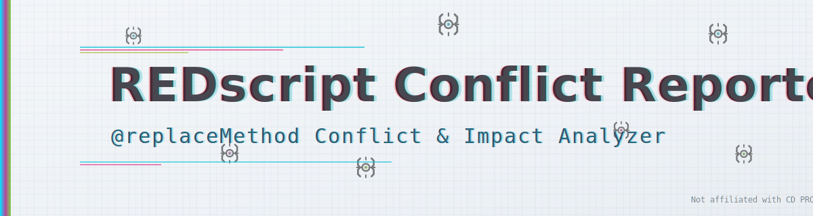

# REDscript Conflict Reporter

<p align="center">
  
  <br/>
  <sub><em><a href="assets/branding/banner_dark.svg">Dark variant</a> / Branding assets licensed under MIT (see assets/branding/LICENSE.txt)</em></sub>
</p>

> 🌐 **Language Selection** | **言語選択**
>
> - [🇺🇸 English](README.en.md)
> - [🇯🇵 日本語](README.ja.md)

---

Advanced tool for detecting and analyzing REDscript `@replaceMethod` conflicts in Cyberpunk 2077 MODs with comprehensive impact assessment.

Cyberpunk 2077 MODの REDscript `@replaceMethod` 競合を検出・分析し、詳細レポートを出力するツールです。

## Quick Start

### GUI Version (Recommended)
```bash
python gui_conflict_report.py
```

### CLI Version
```bash
# Basic execution (conflicts only, default)
python redscript_conflicts_report.py

# All entries output (conflicts + reference list)
python redscript_conflicts_report.py --mode reference
```

## Features

- 🔍 **Conflict Detection**: Precisely identifies MOD conflicts via `@replaceMethod` analysis
- 📊 **Impact Assessment**: Heuristic analysis with severity levels (Critical/High/Medium/Low)
- 📝 **Multi-format Output**: Detailed reports in JSON, Markdown, and HTML formats
- 🎨 **Rich GUI**: WebView2-powered preview, real-time filters, dark/light themes
- 🌐 **Internationalization**: Japanese/English support, extensible via `i18n/*.json` files

## System Requirements

### For Executable (.exe) Version

**Minimum Requirements:**
- **OS**: Windows 10 (version 1809 or later) / Windows 11
- **Architecture**: x64 (64-bit)
- **Memory**: 512 MB RAM minimum, 1 GB recommended
- **Storage**: 50 MB free disk space
- **Display**: 1024x768 resolution minimum

**Optional (for enhanced GUI experience):**
- **WebView2 Runtime**: Microsoft Edge WebView2 Runtime for rich HTML preview
  - Usually pre-installed on Windows 10/11
  - Download: https://developer.microsoft.com/microsoft-edge/webview2/
- **Internet Connection**: For downloading WebView2 Runtime (if not present)

**Note**: The executable is self-contained and does not require Python installation.

### For Python Source Version

- **Python**: 3.8 or later
- **OS**: Windows 10/11, Linux, macOS
- **Dependencies**: Standard library only (no external packages required)
- **Optional**: `tkwebview2` package for enhanced WebView2 support

## Documentation

For detailed documentation, please select your preferred language:

- **[🇺🇸 English Documentation](README.en.md)** - Complete English guide
- **[🇯🇵 日本語ドキュメント](README.ja.md)** - 完全な日本語ガイド

## License

MIT License - See [LICENSE](LICENSE) file for details.

---

## Branding / Banner Usage

The repository includes custom SVG banner assets in `assets/branding/`:

| File | Purpose |
|------|---------|
| `banner_light.svg` | Primary light theme banner (README top) |
| `banner_dark.svg` | Alternate dark theme variant |
| `LICENSE.txt` | MIT license for these branding assets |

### Permitted
- Use the banners in forks, docs, mod pages, or showcase posts
- Recolor, crop, minify (optimize) while retaining core legibility
- Embed in external wikis with attribution (license notice retained)

### Prohibited / Caution
- Do not imply affiliation with CD PROJEKT RED
- Do not add official Cyberpunk 2077 logos or proprietary fonts
- Do not redistribute a modified banner that introduces trademarked material

### Attribution Example
```
Banner adapted from REDscript Conflict Reporter (MIT Licensed)
Not affiliated with or endorsed by CD PROJEKT RED.
```

---

*REDscript-Conflict-Reporter is developed to improve the stability of the Cyberpunk 2077 MOD community.*